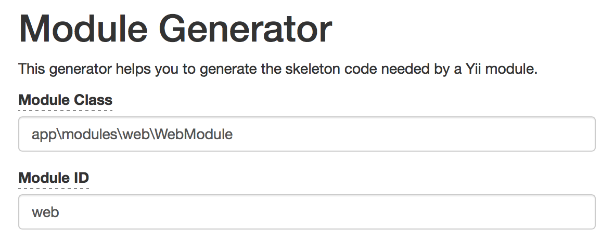

### 六、gii工具生成module实现业务架构调整

我们要开发的是一个包含web后台和移动端的应用，这时候就需要使用yii2的gii工具生成对应的module。

<p align="center">
    
</p>

> 访问 http://www.yii2demo.com/gii ，选择`Module Generator`，分别生成web模块、m模块

<p align="center">
    
</p>

复制下面的内容到config/web.php中：

<p align="center">
    
</p>

```
    ],
    'params' => $params,
    'modules' => [
        'web' => [
            'class' => 'app\modules\web\WebModule',
        ],
    ],
];
```
同样的方式添加m模块，注意目录结构。

然后可以通过 http://www.yii2.book.com/m/ 访问m模块， http://www.yii2.book.com/web/ 访问web模块